<h1>Отчет по лобораторной 11</h1>
</br>gmail почта - sgolenkov2002@gmail.com </br>
telegram - @Xacker_ducker

<h2>Ход выполнения лабораторной работы:</h2>

Были выплнены следующие команды
```shell
cd ~
mkdir install
mkdir tmp
export HOME_PREFIX=`pwd`/install
echo $HOME_PREFIX
export USERNAME=`whoami`
cd tmp
wget https://github.com/libevent/libevent/releases/download/release-2.1.8-stable/libevent-2.1.8-stable.tar.gz
tar -xvzf libevent-2.1.8-stable.tar.gz
cd libevent-2.1.8-stable
./configure --prefix=${HOME_PREFIX}
make && make install
cd ..
wget http://invisible-island.net/datafiles/release/ncurses.tar.gz
tar -xvzf ncurses.tar.gz
cd ncurses-6.2 #команда была изменена, тк именно эта версия была скачана
./configure --prefix=${HOME_PREFIX}
make && make install
cd ..
wget https://github.com/tmux/tmux/releases/download/2.5/tmux-2.5.tar.gz
tar -xvzf tmux-2.5.tar.gz
cd tmux-2.5
./configure --prefix=${HOME_PREFIX} CFLAGS="-I${HOME_PREFIX}/include -I${HOME_PREFIX}/include/ncurses" LDFLAGS="-L${HOME_PREFIX}/lib"
make && make install
cd ..
wget https://bin.equinox.io/c/4VmDzA7iaHb/ngrok-stable-linux-amd64.zip
unzip ngrok-stable-linux-amd64.zip
mv ngrok ${HOME_PREFIX}/bin
export LD_LIBRARY_PATH=${HOME_PREFIX}/lib
export PATH="${HOME_PREFIX}/bin:${PATH}"
tmux
cd ~
rm -rf tmp install
brew install tmux ngrok 
tmux new -s session_with_group
# Alisa:
open https://ngrok.com/signup
export NGROK_TOKEN=<токен>
ngrok authtoken ${NGROK_TOKEN}
ngrok tcp 22
<порт_ngrok_сервера>
# Bob:
ssh ${USERNAME}@0.tcp.ngrok.io -p<порт_ngrok_сервера>
<пароль_от_учетной_записи>
tmux a -t session_with_group
<C-B>"
```
Результаты выполнения команд
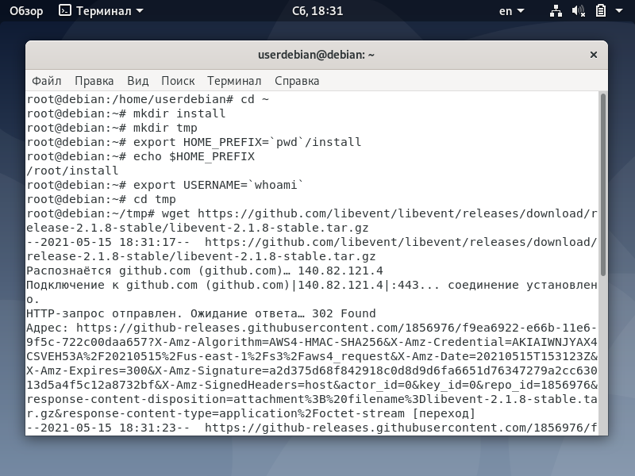</br>
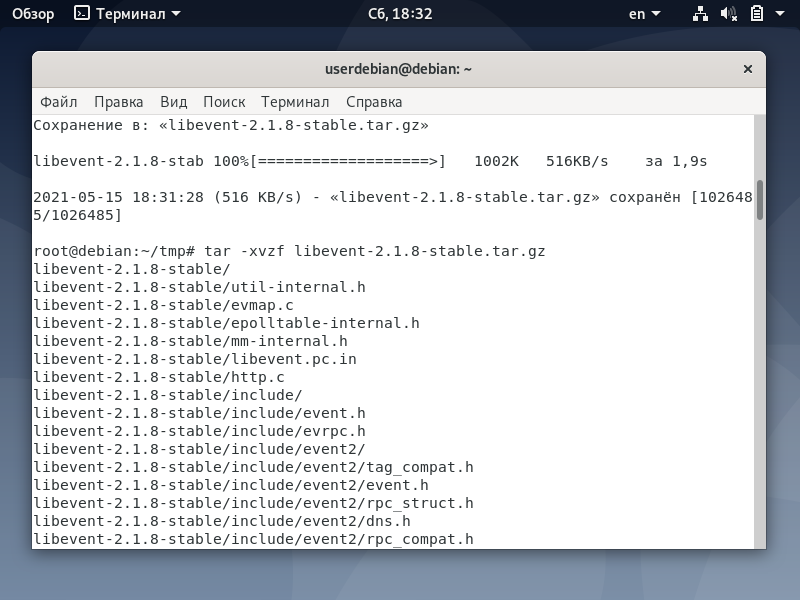</br>
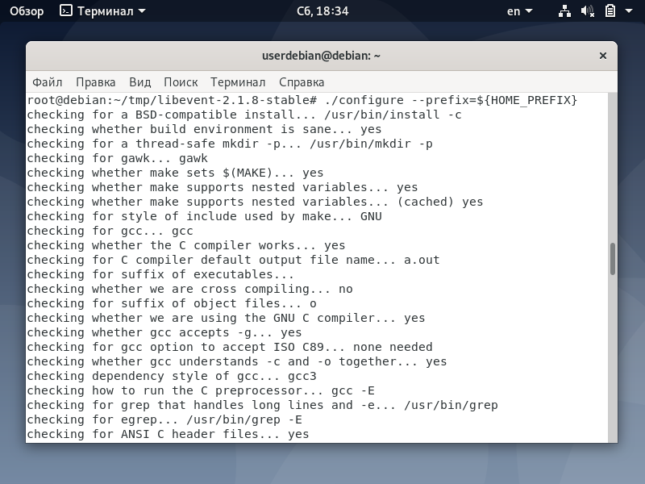</br>
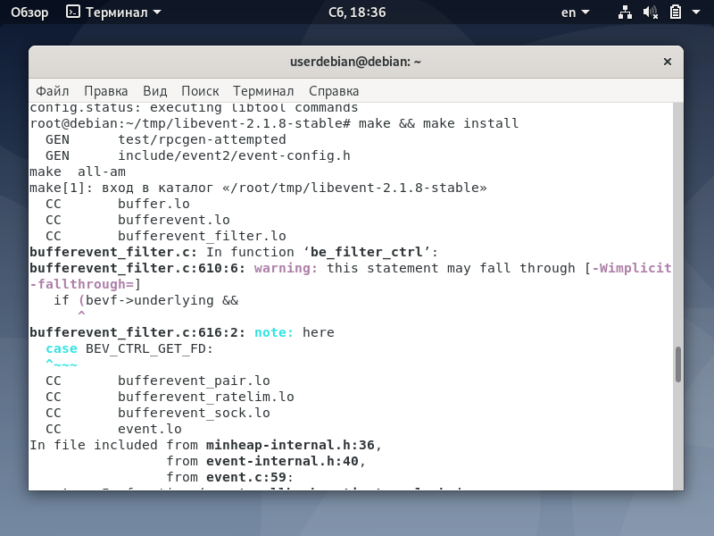</br>
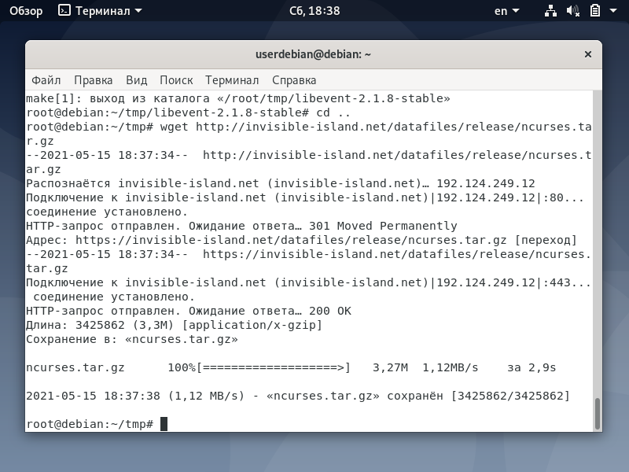</br>
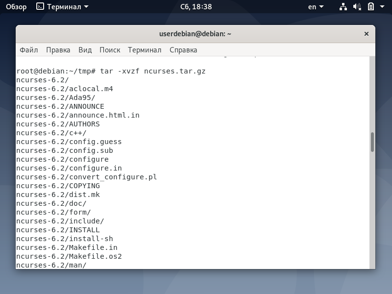</br>
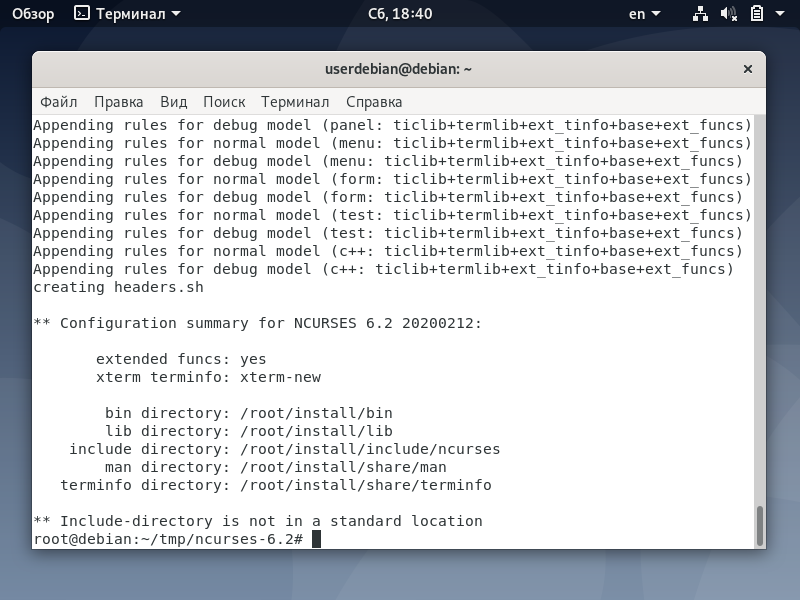</br>
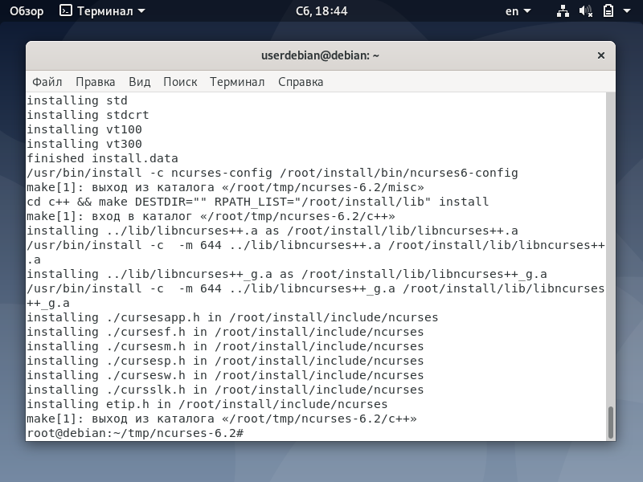</br>
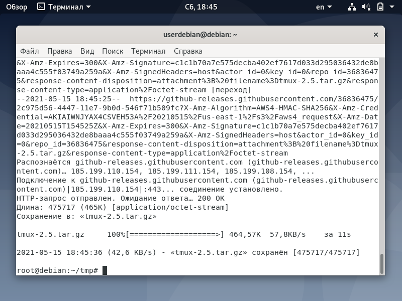</br>
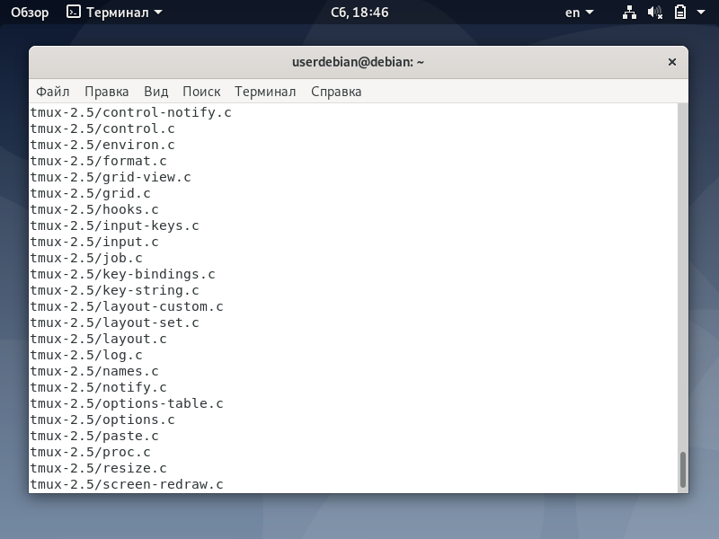</br>
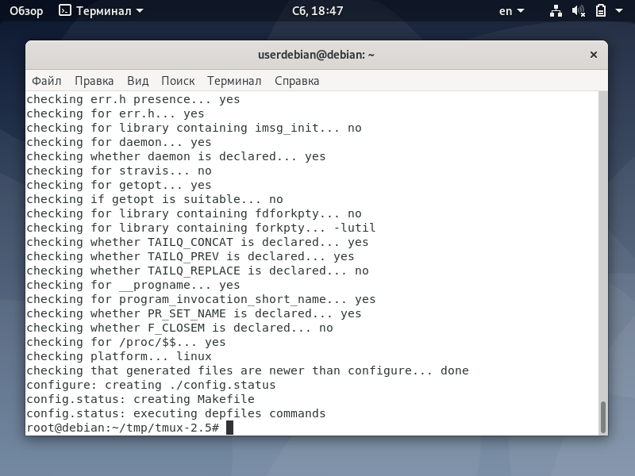</br>
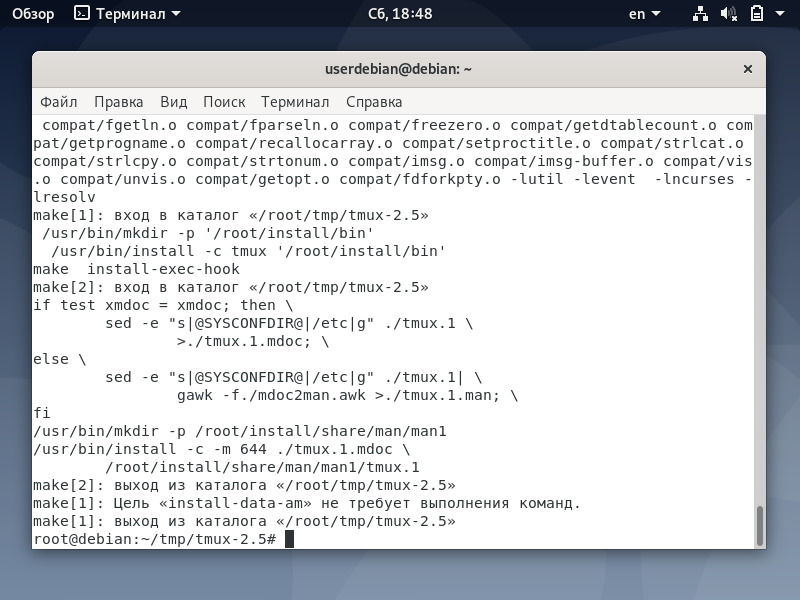</br>
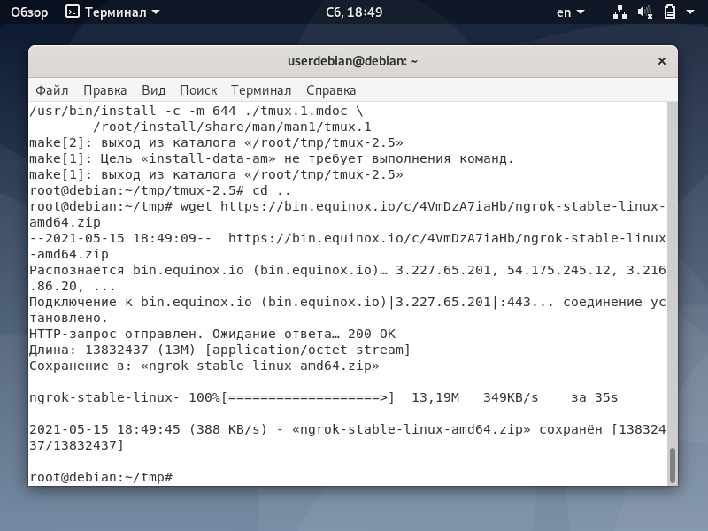</br>
